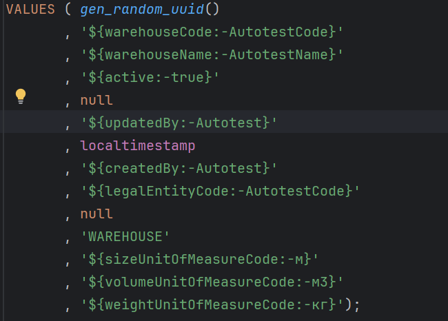
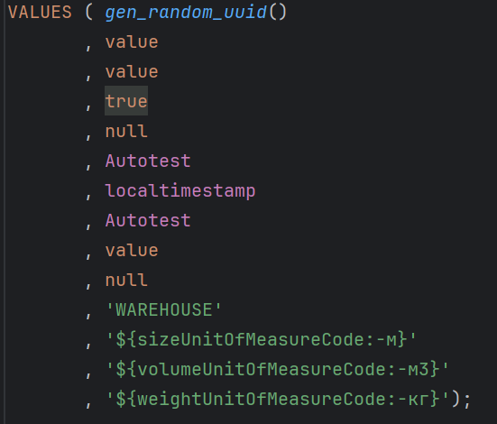

**Первое, что я сделал, это изучил INSERT,UPDATE,DELETE на SQLacademy**

**Второе, это создал свой проект, в котором добавил изменение файла CreateWarehouse.sql, с созданием нового CreateWarehouseEdited.sql**

Пример файла до редактирования:

И после редактирования:

Так же реализовал запрос к бд, с помощью класса ConnectionForDB

